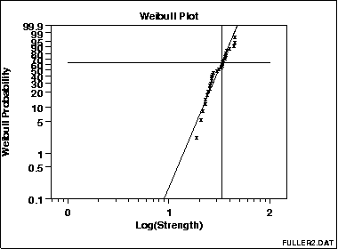

### Weibull Plot

Weibull图([Nelson 1982](http://www.itl.nist.gov/div898/handbook/eda/section4/eda43.htm#Nelson))是一种用于挖掘数据集是否来源一个总体的图形化技术，它可被2个参数的Weibull分布拟合( location 被假定为0).

若数据服从Weibull分布，Weibull图会有特殊的scales，那就是这些点是线性的(或近似线性的)。对这条线进行最小二乘估计得到Weibull分布的形状参数和尺度参数( location 被假定为0)。

具体来说，形状参数是被拟合直线斜率的倒数，尺度参数是被拟合直线截距的指数。

Weibull分布还具有以下属性：尺度参数落在63.2％点，而与形状参数的值无关

该图显示在该63.2％点处的水平线和水平线与最小二乘拟合线相交的垂直线。该垂直线示出尺度参数的值。

这个Weibull图显示：

1. 威布尔分布的假设是合理的;
2. 尺度参数估计为33.32;
3. 形状参数估计为5.28; 
4. 没有异常值。

注意，x轴（“0”，“1”和“2”）上的值是指数。 这些实际上表示值100 = 1,101 = 10和102 = 100。(100表示10的0次方)

威布尔图由以下形成：

- y轴：威布尔累积概率表示为百分比
- x轴：有序故障次数（在LOG10刻度中） 

垂直刻度是ln（-ln（1-p）），其中p =（i-0.3）/（n + 0.4），i是观察的秩。 选择该尺度以便线性化Weibull数据的所得图。

### Youden Plot

Youden图是用于分析interlab数据的图形技术，适用于每个实验室在同一产品上进行两次运行或在两个不同产品上运行一次时。

Youden图是用于比较实验室内变异性和实验室间变异性的简单但有效的方法。

此图显示：

1. 并不是所有的实验室都是等效的。
2. 实验室4偏差低。
3. 实验室3具有实验室内变异性问题。
4. 实验室5有一个outlying。

Youden图形由以下形成：

1. 垂直轴：响应变量1 (i.e., run 1 or product 1 response value)
2. 水平轴：响应变量2(i.e., run 2 or product 2 response value)

此外，图符号是lab id（通常是从1到k的整数，其中k是实验室的数量），有时会绘制45度的基准线，理想情况下，产生两次相同产物的实验室应该按理产生相似的结果。离开此参考线表示与实验室不一致。如果两个不同的产品在测试，45度线则可能不合适。然而，如果实验室是一致的，点应该靠近一些拟合的直线。

Youden图本质上是一个散点图，因此在支持散点图的任何通用统计程序中为Youden图写一个宏应该是可行的。