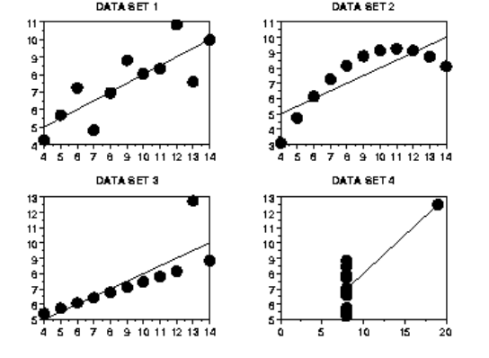
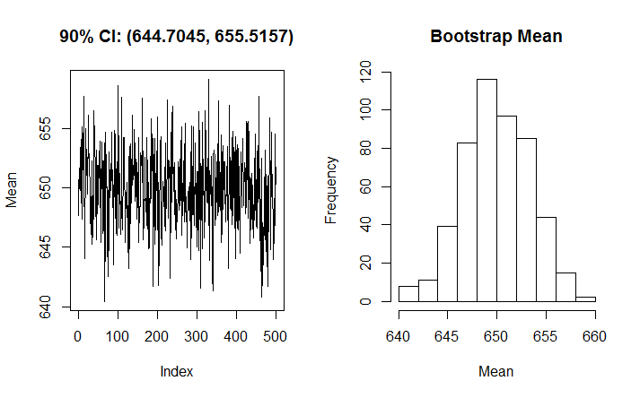
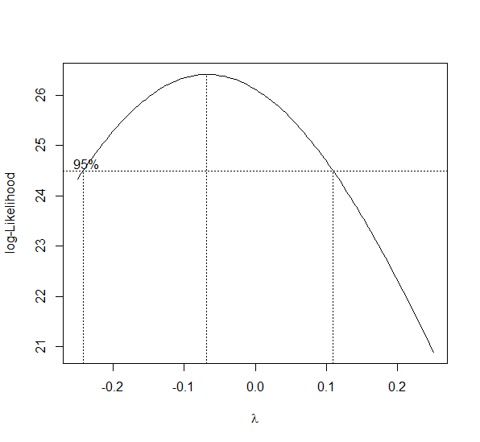
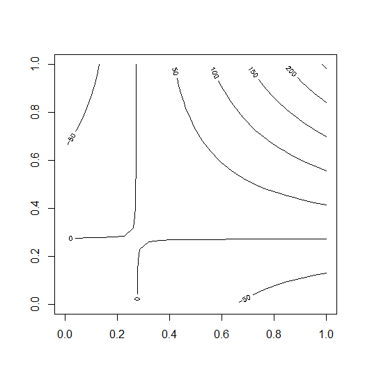
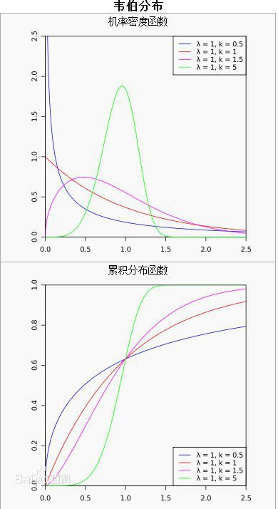
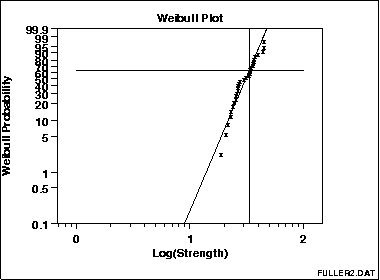
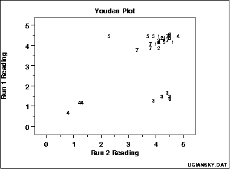
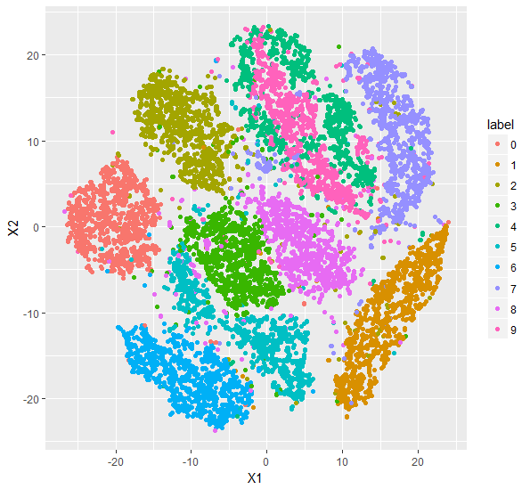
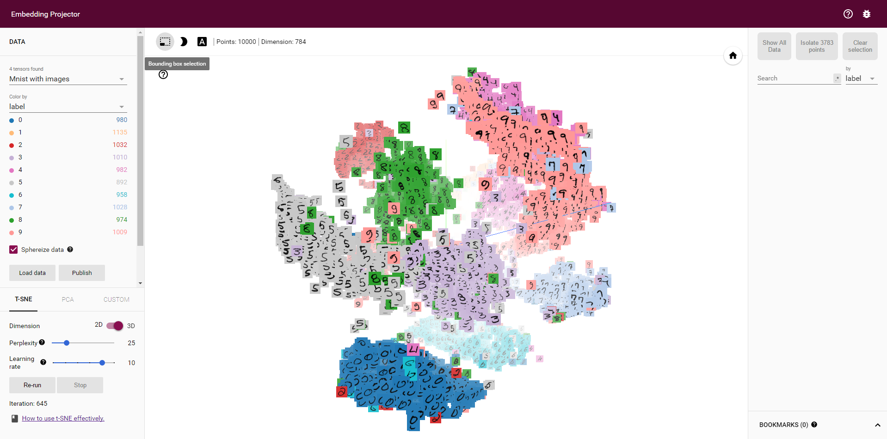

# 探索性数据分析

本文部分用到的数据在这里：

## 介绍

今天我们来谈一谈数据探索(Exploratory Data Analysis,EDA)。首先什么是探索性数据分析？

实际上，这是一系列的方法，它的目的就是让你最大化对数据的直觉，为了让你对数据有感觉，你不仅需要知道数据里有什么，你还需要知道数据里没有什么，而完成这件事情的方法只有一个，那就是结合各种统计学的图形把数据以各种形式展现在我们面前。它可以完成这些事情：

1. 让你最大程度得到数据的直觉
2. 发掘潜在的结构
3. 提取重要的变量
4. 删除异常值
5. 检验潜在的假设
6. 建立初步的模型
7. 决定最优因子的设置


举一个例子：

| X1   | Y1    | X2   | Y2   | X3   | Y3    | X4   | Y4   |
| ---- | ----- | ---- | ---- | ---- | ----- | ---- | ---- |
| 10   | 8.04  | 10   | 9.14 | 10   | 7.46  | 8    | 6.58 |
| 8    | 6.95  | 8    | 8.14 | 8    | 6.77  | 8    | 5.76 |
| 13   | 7.58  | 13   | 8.74 | 13   | 12.74 | 8    | 7.71 |
| 9    | 8.81  | 9    | 8.77 | 9    | 7.11  | 8    | 8.84 |
| 11   | 8.33  | 11   | 9.26 | 11   | 7.81  | 8    | 8.47 |
| 14   | 9.96  | 14   | 8.1  | 14   | 8.84  | 8    | 7.04 |
| 6    | 7.24  | 6    | 6.13 | 6    | 6.08  | 8    | 5.25 |
| 4    | 4.26  | 4    | 3.1  | 4    | 5.39  | 19   | 12.5 |
| 12   | 10.84 | 12   | 9.13 | 12   | 8.15  | 8    | 5.56 |
| 7    | 4.82  | 7    | 7.26 | 7    | 6.42  | 8    | 7.91 |
| 5    | 5.68  | 5    | 4.74 | 5    | 5.73  | 8    | 6.89 |

有这么一些数据，如果你通过一些描述性的指标来表示这些数据，你或许可以得到这些：

对于X1 Y1这两列数据

N = 11
Mean of X = 9.0
Mean of Y = 7.5
Intercept = 3
Slope = 0.5
Standard deviation of residuals = 1.126
Correlation = 81.7% 

对于X2 Y2这两列数据

N = 11
Mean of X = 9.0
Mean of Y = 7.5
Intercept = 3
Slope = 0.5
Standard deviation of residuals = 1.126
Correlation = 81.7% 

对于X3 Y3这两列数据

N = 11
Mean of X = 9.0
Mean of Y = 7.5
Intercept = 3
Slope = 0.5
Standard deviation of residuals = 1.126
Correlation = 81.7% 

X4 Y4跟他们都是一模一样的，但是如果你把他们画出来你会发现他们完全不一样。



我们从图中可以非常容易看出

1. 数据集1 是明显的线性关系
2. 数据集2 是明显的二次关系
3. 数据集3 明显存在异常值
4. 数据集4 显然是糟糕的实验设计造成的。有一个点飞去了远方


## EDA技术

在这一节将要介绍当你拿到一些数据时，去探索它所用到的一些技术，以及分析的方法。这些技术可以划分为两类，一是基于图像的，二是基于定量方法的。


探索性数据分析常用的一些常见问题：

1. 数据的典型值是多少(均值，中位数等)？


2. 典型值的不确定性是什么？


3. 一组数据的良好分布拟合是什么？


4. 数据的分位数是多少？


5. 一个工程上的修改是否有作用？


6. 一个因子是否有影响？


7. 最重要的因素是什么？


8. 来自不同实验室的测量结果是否相等？


9. 将响应变量与一组因子变量相关联的最佳函数是什么？


10. 什么是最好的因子设置？


11. 我们可以将时间相关数据中的信号与噪声分离吗？
12. 我们可以从多变量数据中提取任何结构吗？
13. 数据是否有离群值？

第一步，你需要根据你的任务来决定EDA需要回答以上哪些问题，哪些问题对你来说是最重要的。当你决定好需要回答哪些问题时，就可以选择合适的EDA技术去回答你的问题。


接来下我会逐一介绍各个数据探索的技术

### 1.自相关图

这是一种常见的检验数据集随机的技术。它通过计算不同时滞下的


图中的Y轴是自相关系数：
$$
R_h=\frac{C_h}{C_0}
$$
其中$C_h$是自协方差
$$
C_h=\frac{1}{n-h}\sum_{t=1}^{n-h}{(Y_t-\overline{Y})((Y_{t+h}-\overline{Y}))}
$$
$$
C_0=\frac{1}{n-1}\sum_{t=1}^{n}{(Y_t-\overline{Y})^2}
$$


$R_h$取值在-1到1之间

横坐标是：时滞(time lag) h(h=1,2,3,...)

从形式上看$C_h$有点像协方差，但它并不是协方差。而$C_0$则是序列的样本方差。自相关图刻画了不同时滞下时间序列的自相关性。所以自相关图还常常用来对AR模型进行定阶。

比如说有这么一个时间序列AR(2)：
$$
x_t=\beta_1 x_{t-1}+\beta_2 x_{t-2}+\epsilon_t
$$
那么它的1阶，2阶的自相关系数应该很大,然后阶数越大，自相关系数逐渐减少。

自相关图可以回答以下几个问题：

1. 数据是否是随机的？
2. 一些观测值会不会与它附近的观测值相关？
3. 该时间序列是不是白噪声？
4. 是不是正弦波？
5. 是不是自回归的？
6. 适合它的时间序列模型是什么？
7. 模型是不是$Y = constant + error$这种形式？

我们对比几张自相关图看看：

随机序列:


弱自相关(系数的取值很小)：


强自相关：


正弦波：


### 2.双柱状图(Bihistogram)

这是一种与两样本t检验相对应的技术，当你还在纠结于均值，尺度，偏度，异常值，峭度等等数字背后直观感觉时，其实简单的把数据的直方图就很明显了。


它除了比较两个变量的分布之外，还可以有另外的用法。比如说，我们可以画出不同性别，男女这两个水平下的身高的分布，从而比较性别是否会对身高有显著的影响。

可以用R语言来画该图

```R
library(Hmisc)
histbackback(split(y,batch),ylab="Strength of Ceramic",
             brks=seq(300,900,by=25))
```


### 3.块图(Block Plot)

这是一个对应于方差分析(ANOVA)的EDA技术。它可以给予我们方差分析所没有的直观感受。它可以直观地判断一个因子是否有用。


- 纵坐标：变量Y的值（平均失败每小时）
- 横坐标：所有次要因子的水平的组合（在这里是plant speed shift这3个因子共有$2*2*3=12$种组合）
- 图中的1,2表示主要因子(weld method)取1和取2时对Y的不同影响。

从图中我们可以看到，显然不管次要因子的取值如何，weld method取2时，大部分时间都比取1更有效。从而证明了，我们这个weld method因子是一个非常泛化和稳定的特征。我们也可以从图中看到次要因子的哪一个组合是最有效的。

1. Is the factor of interest significant?
2. Does the factor of interest have an effect?
3. Does the location change between levels of the primary factor?
4. Has the process improved?
5. What is the best setting (= level) of the primary factor?
6. How much of an average improvement can we expect with this best setting of the primary factor?
7. Is there an interaction between the primary factor and one or more nuisance factors?
8. Does the effect of the primary factor change depending on the setting of some nuisance factor?
9. Are there any outliers?

画图代码：

```R
library(dplyr)
avg<-df%>%
  group_by(lab,batch)%>%
  summarise(x=mean(y))

## Generate the block plot.
boxplot(avg$x ~ avg$lab, medlty="blank",
        ylab="Ceramic Strength",xlab="Laboratory",
        main="Batch Means for Each Laboratory")
## Add labels for the batch means.
text(avg$lab[avg$batch==1], avg$x[avg$batch==1],
     labels=avg$batch[avg$batch==1], pos=1)
text(avg$lab[avg$batch==2], avg$x[avg$batch==2],
     labels=avg$batch[avg$batch==2], pos=3)
```


### 4.Bootstrap Plot


- 纵坐标：有放回抽样的样本计算出来的统计量
- 横坐标：抽样的次数

Bootstrap Plot就是简单地把每次抽样，从而计算得到的统计量画出来




这图是500次随机抽样，计算均值的Bootstrap图，可以看到均值集中在650左右,同时也可以计算出均值所在的90%置信区间是[644.7045,655.5157]

要注意的是bootstrap 并不适用于所有的分布和统计量。 例如，由于均匀分布的形状，bootstrap 不适于估计严重依赖于尾部的统计的分布，例如取值范围。

```R
library(boot)
## Bootstrap and CI for mean.  d is a vector of integer indexes
set.seed(0)
samplemean <- function(x, d) {
  return(mean(x[d]))                   
}
b1 = boot(y, samplemean, R=500)   
z1 = boot.ci(b1, conf=0.9, type="basic")
meanci = paste("90% CI: ", "(", round(z1$basic[4],4), ", ", 
               round(z1$basic[5],4), ")", sep="" )
## Generate bootstrap plot.
par(mfrow=c(1,2))
plot(b1$t,type="l",ylab="Mean",main=meanci)
hist(b1$t,main="Bootstrap Mean",xlab="Mean")
```


### 5.Box-Cox Linearity Plot

box-cox变换：
$$
x_\lambda=\frac{x^\lambda-1}{\lambda}
$$
它可以用来消除偏斜和其他分布特征，使得能够将数据向正态分布靠拢。这样做的目的是因为大部分模型或检验都需要对变量的分布做正态性假设，如果变量不满足正态分布，那么就有可能导致模型不准确，那么做一个box-cox变换或许是一个不错的选择。


这一个图可以回答这两个问题

1. box-cox变换是否对拟合效果有提升?
2. box-cox变换最合适的参数是什么?


当然，对于boxcox的参数$\lambda$选择，我们可以选择一个$\lambda$使得数据变换后的正态性最强来进行选择。

以下是通过对Y回归，然后计算不同$\lambda$下回归后的正态性，如果拟合的Y值越满足正态分布则认为该$\lambda$的取值越好（这是因为线性模型是假设噪声服从正态分布的）




```R
library(MASS)
boxcox(Volume ~ log(Height) + log(Girth), data = trees,
       lambda = seq(-0.25, 0.25, length = 10))
```

### 6.箱线图

这个大家都很熟，我也不多说。简单地说，箱线图刻画了一个变量的1/4分位数 3/4分位数，中位数，还有异常值。


箱线图同样可以用来判断一个因子的影响是否显著，通过将不同水平的箱线图画出来，看看是否会对目标变量Y的分布有影响。

### 7.Complex Demodulation Amplitude Plot

一个常用的时间序列分析模型就是一个正弦模型：
$$
Y_i=C+\alpha \sin(2\pi wt_i+\phi)+E_i
$$
在这里，$\alpha$是振幅，$\phi$是移相，$w$是频率。这里的振幅$\alpha$是一个常数，它是与$t$无关的。

而这个图，则是用来确定这个振幅是不是一个常用的。即模型可以写成这样：
$$
Y_i=C+\alpha_i \sin(2\pi wt_i+\phi)+E_i
$$
这里的$\alpha_i$可以是一个与$t_i$是线性的关系，也可以是一个二次方的关系。我们常用线性关系的来表示，那么模型就可以写成：
$$
Y_i=C+(B_o+B_1t_i) \sin(2\pi wt_i+\phi)+E_i
$$
我们通过把不同时间下的振幅计算出来，就可以得到我们的Complex Demodulation Amplitude Plot：


- 振幅稳定在390附近
- 振幅有一个启动的过程
- 在$t=160$左右振幅有一个较大的波动，可以考虑在那附近出现了异常，需要仔细排查。


还有一个画移相的图


### 8.等高线图(Contour Plot)

当你有3个变量时，你可以使用等高线图来观测x，y的取值对z变量的影响。当然，你可以选择画三维图。



```R
#等高线图一个简单的例子
x <- -6:16
contour(outer(x, x), method = "edge", vfont = c("sans serif", "plain"))
```

**DOE Contour Plot**

这是一种专门用于[全因子设计](https://en.wikipedia.org/wiki/Factorial_experiment)和[部分因子设计](https://en.wikipedia.org/wiki/Fractional_factorial_design)的等高线图。通常这些设计用"-1"或"-"表示低水平，用"+1"或"+"表示高水平。也有可能出现中水平，则用"0"表示。

看不懂 下一个。。

### 9.DOE Scatter Plot

DOE散点图是用于分析试验数据的方法。它画出了每个因子对应的每个水平对因变量Y的影响。如果每个水平有重复值，那么就可以用这个方法，将不同水平对应的Y取值画到图上。同样，你也可以画出不同水平下的均值或标准差，然后用直线连接，那么这就是 [DOE mean plot](http://www.itl.nist.gov/div898/handbook/eda/section3/dexmeanp.htm)和[DOE standard deviation plot](http://www.itl.nist.gov/div898/handbook/eda/section3/dexsdplo.htm)。 


在这个图中，有7个因子，里面中间的水平线表示所有数据的均值。从这个图里面我们可以看到：

1. 这里没有异常值
2. 因子2，4显然不同水平间有显著的差异
3. 因子1则显示出了比例误差（scale differences）

同理，如果我们画出每个水平对应Y的均值就可以得到DOE Mean Plot


从这个图可以看出因子的重要程度为：4>2>1>7>6>3,5

它可以用来判断因子的重要程度，以及重要程度的排名。

画出不同因子水平的标准差就可以得到DOE Standard Deviation Plot


1. 因子1的标准差有着很大的差异
2. 因子4的标准差都比较小
3. 对于所有的因子，它的第一个水平的标准差总是比第二个水平低


### 10.Lag plot

lag plot可以用来检查数据或时间序列是不是随机序列。如果是随机的，那么在lag plot中是看不出任何结构的。


这个图就是简单地以$Y_{i-1}​$作为横轴，$Y_i​$作为纵轴。

从上面这个图可以看出$Y_{i-1}$和$Y_i$有着显著的线性关系。这一个数据显然是非负的，而且也可以看出这个时间序列或许是满足自回归模型的。

当然，同样可以使用滞后2期，3期来画这个图，不过一般都设lag=1.

我们多看几个例子：

随机数据：


适中程度的自回归:


强烈的自回归：


数据服从正弦模型以及存在离群值：


```R
data=cumsum(runif(100,-5,5))
lag.plot(data)
```


### 11.线性相关图（Linear Correlation Plot）

线性相关图常用于评估各组之间对目标变量Y的相关性是否一致。除了考虑相关性是否一致，你也可以考虑斜率(Linear Slope Plot)或截距(Linear Intercept Plot)与目标变量Y是否一致。

举个例子，你可以将一个一年的数据分为12个月，你希望知道每个月的客流量对你商品销量的影响是否一样。那你就可以画线性相关图来检验你的假设。

当然，有时候你的数据可能没有分组，那么如果你有的数据来自不同的数据源，也可以把数据源作为分组。


从这个图可以看到每个组的相关性都是差不多的。

如果我们把相关系数变成截距可以得到：


可以看到截距是有所差异的，不过这些差异其实很小。

再看看斜率的：


所有的分组的斜率都在0.174的附近，偏差0.002，差异也很小，这可能意味着我们只需用其实一个分组进行拟合就足够了。

你还可以画出不同分组拟合后残差的标准差：


其中实线部分是使用全部数据的误差的标准差，这个值一般都会比分组数据的大。

### 12.均值图(Mean Plot)

均值图一般用来比较数据中不同分组之间均值的差异。这个分组是由分析师决定的。比如说，我们可以用一个月作为一组，这样一年就可以分成12组。所以这个均值图就是将每个分组的均值画出来就可以了。当然，你也可以将均值替换成中位数，众数，[切尾平均数](https://www.baidu.com/link?url=q2q3v23jg3kRe4qn6HaHbAvqVtQIg8q4T9SnGojeyfNJcnf10WryUZ7QrUq5kFUojOo83K7bQWaj6DjxypI61KzI8KFCws6dme7QjNGzcibzcrCpyAN49b9QbZ86VQwWNcR8jSgIib73hgD3nceqfK&wd=&eqid=808155c30001374f000000065899d0c4)，[缩尾均值](https://en.wikipedia.org/wiki/Winsorized_mean)等统计量。


这个图可以回答以下问题：

1. 分组间的均值是否有变动？
2. 分组间的均值差异多大？
3. 均值的变动是否有一些独有的模式在里面？


### 13.Q-Q图(Quantile-Quantile Plot )与P-P图(probability–probability plot)

P-P图是数据的经验累积分布函数与特定的累积分布函数F（·）间的比较。 而Q-Q图则是数据分位数与某个理论分布分位数间的比较。 P-P图和Q-Q图的构造和解释主要有三个不同点：

- Q-Q图的构造不需要指定F（·）的位置或尺度参数。理论分位数可以从一个指定的理论分布中直接计算。若点在图上的排列呈线性，而且位置和尺度参数可以直观地对应于该直线的截距和斜率。相比之下，P-P图的构造需要F（·）的位置和尺度参数来评估有序数据的cdf。


- Q-Q图上点是否呈线性趋势并不受分布的位置或尺度参数变化的影响。而在P-P图上，位置或尺度的变化不一定能保持线性。


- 在Q-Q图上，表示特定理论分布的参考线取决于该分布的位置和尺度参数，其截距和斜率对应于位置和尺度参数。在P-P图上，任何分布的参考线总是对角线y = x。

因此，如果您的目标是将数据分布与仅在位置和规模上变化的分布族进行比较，特别是如果要从图中估计位置和比例参数，则应使用Q-Q图。

P-P图的优点是它们在高概率密度的区域是可区分的，因为在这些区域中，经验和理论累积分布比在低概率密度区域变化得快的多。例如，如果将数据分布与特定的正态分布进行比较，两个分布间的差异在P-P图上要比在Q-Q图更明显。


这是一个QQ图，从这个图里面可以看出：

- 这两个batch的数据（横纵坐标）显然不是来自同一个分布的
- batch1的数据明细的大于batch2的数据
- 数据在525到625间差异较大，而再之后则差异没那么大。

QQ图的组成：

- 横坐标：数据集1的分位数
- 纵坐标：数据集2的分位数

QQ图可以告诉我们：

- 两个数据是否来自同一分布，你也可以检验数据是否来自某个特定分布，比如说正态分布，这时你只需要计算正态分布的理论分位数就可以了，下面同理。
- 两个数据是否有相同的位置与尺度
- 两个数据是否有相似的分布形状
- 两个数据的分布的尾部是否有相似的地方

### 14.散点图

这或许是最为常用的方法之一了，我估计大家都很熟。。我就简单过一下

这是随机数据的散点图形状：


线性相关的数据：


二次曲线的数据：


指数关系的数据：


正弦数据：


与X独立的同方差扰动：


与X不独立的异方差性（随着X增大噪声的方差也增大）：


关于异方差，这个可以通过加权最小二乘法，boxcox变换，对数变换等方法来解决。

### 15.Spectral Plot

通过傅里叶变换，将数据从时域变换到频域


看上面这幅动图，里面最后蓝色的线就是我们的Spectral Plot

如果模型是这个形式的：
$$
Y_i=C+\alpha sin(2\pi wt_i+\phi)+E_i
$$


从这幅图可以看出其主要频率是0.3

这个图可以回答一下问题：

1. 有多少个周期成分在里面？
2. 是否有一个重要的频率？
3. 这是重要的，影响最大的频率是多少？

关于傅里叶变换已经有很多出色的资料，我不多说了，比如说这个，[傅里叶分析之掐死教程（完整版）](https://zhuanlan.zhihu.com/p/19763358?columnSlug=wille)


### 16.Weibull Plot

威布尔分布（Weibull distribution），又称韦伯分布或韦布尔分布，是可靠性分析和寿命检验的理论基础。它在可靠性工程中被广泛应用，尤其适用于机电类产品的磨损累计失效的分布形式。由于它可以利用概率值很容易地推断出它的分布参数，被广泛应用于各种寿命试验的数据处理。

它的条件概率密度如下：

$$f(x;\lambda,k) =\begin{cases}\frac{k}{\lambda}\left(\frac{x}{\lambda}\right)^{k-1}e^{-(x/\lambda)^{k}} & x\geq0 ,\\0 & x<0,\end{cases}$$

其中$k>0$是形状(shape)参数，$\lambda>0$是尺度(scale)参数。




对于这个分布的解释我们可以这样理解，

- $k<1$表示失败概率随着时间的增加而减少。这一现象可能出现在非常容易在早期出现夭折的现象上(infant mortality)，随着时间的增加，那些存活下来的个体有更强的适应力，因此死亡概率反而减少。
- $k=1$失败概率一直不变
- $k>1$失败概率随着时间增加而增加。这一情况通常会出现在寿命等问题上。

若数据服从Weibull分布，那么数据就会有如此的关系：

$$
\begin{align}F(x) &= 1-e^{-(x/\lambda)^k}\\-\ln(1-F(x)) &= (x/\lambda)^k\\\underbrace{\ln(-\ln(1-F(x)))}_{\textrm{'y'}} &= \underbrace{k\ln x}_{\textrm{'mx'}} - \underbrace{k\ln \lambda}_{\textrm{'c'}}\end{align}
$$


我们把ln(x)作为x轴，$ln(-ln(1-F(x)))$作为Y轴就可以得到以下这个图：




该图显示在该63.2％点处的水平线和水平线与最小二乘拟合线相交的垂直线。该垂直线示出尺度参数的值。


这个Weibull图显示：

1. 威布尔分布的假设是合理的;
2. 尺度参数估计为33.32;
3. 形状参数估计为5.28; 
4. 没有异常值。

注意，x轴（“0”，“1”和“2”）上的值是指数。 这些实际上表示值100 = 1,101 = 10和102 = 100。(100表示10的0次方)

威布尔图由以下形成：

- y轴：威布尔累积概率表示为百分比
- x轴：有序故障次数（在LOG10刻度中） 

垂直刻度是ln（-ln（1-p）），其中p =（i-0.3）/（n + 0.4），i是观察的秩。 选择该尺度以便线性化Weibull数据的所得图。

### 17.Youden Plot

Youden图是用于分析interlab数据的图形技术，适用于每个实验在同一产品上进行两次评估或在两个不同产品上运行一次评估时。

Youden图是用于比较实验室内变异性和实验室间变异性的简单但有效的方法。



此图显示：

1. 并不是所有的实验室都是等效的。
2. 实验室4偏差低。
3. 实验室3具有实验室内变异性问题。
4. 实验室5有一个异常值。

Youden图形由以下形成：

1. 横坐标：响应变量1 (i.e., run 1 or product 1 response value)
2. 纵坐标：响应变量2(i.e., run 2 or product 2 response value)

此外，图符号是lab id（通常是从1到k的整数，其中k是实验室的数量），有时会绘制45度的基准线，理想情况下，产生两次相同产物的实验室应该按理产生相似的结果。离开此参考线表示与实验室不一致。如果两个不同的产品在测试，45度线则可能不合适。然而，如果实验室是一致的，点应该靠近一些拟合的直线。

Youden图本质上是一个散点图，因此在支持散点图的任何通用统计程序中为Youden图写一个宏应该是可行的。

### 18.t-sne

我觉得在这里有必要提一下t-sne这个技术。想象一下你有一个包含数百个特征（变量）的数据集，对数据所属的域几乎没有什么了解。 您需要识别数据中的隐藏模式，探索和分析数据集。 

这是否让你不舒服？ 它让我的手汗水，当我第一次遇到这种情况。 你想知道如何探索一个多维数据集吗？ 这是许多数据科学家经常问的问题之一。 而t-sne可以做到这一点。目前有很多t-sne介绍的文章，比如：[从SNE到t-SNE再到LargeVis](http://bindog.github.io/blog/2016/06/04/from-sne-to-tsne-to-largevis)

和[Comprehensive Guide on t-SNE algorithm with implementation in R & Python](https://www.analyticsvidhya.com/blog/2017/01/t-sne-implementation-r-python/)。

简单地说它是一种非线性降维的算法。通过将数据降到2维或3维，然后就可以用一个散点图或3d图来表示我们这些高维的数据，而且它的效果也非常的好。

这个算法的核心思想就是，高维数据下数据间的距离，与映射到低维后数据间的距离应该是非常相似的。通过优化这个目标就可以得到非常好的效果。它与SNE不同的地方就是将低维空间下数据间的距离用t分布来表示，这就可以使得高维中距离较近的点在低维更近，高维中距离较远的点在低维更远。具体原因可以看这里[从SNE到t-SNE再到LargeVis](http://bindog.github.io/blog/2016/06/04/from-sne-to-tsne-to-largevis)


我们来试试这个算法，先下载一份minist数据：https://pan.baidu.com/s/1bpiT3Vh

这是一份手写字体图片的数据，每个样本是一个图片，每个图片的大小是28*28，展开后就一共有784个取值为0-254的像素特征。这里一共有10000个样本。数据的第一列是标签。

我们在R运行下面代码可以得到这样的图：



可以看到基本上相同数字的变量都聚集在一起了，它的区分效果也是很棒的。不过绿色跟粉色的区分度就比较低。

```R
#t-sne------
## calling the installed package
train<- read.csv(file.choose()) ## Choose the train.csv file downloaded from the link above  
set.seed(0)
library(Rtsne)
Labels<-train$label
train$label<-as.factor(train$label)

## Executing the algorithm on curated data
tsne <- Rtsne(train[,-1], dims = 2, perplexity=30, verbose=TRUE, max_iter = 500)

## Plotting
library(ggplot2)
df=data.frame(tsne$Y,label=train$label)
ggplot(df,aes(x=X1,y=X2,color=label))+geom_point()
```


它在tensorflow中同样也有相应的实现，具体可以看：[谷歌开源Embedding Projector，可将高维数据可视化](https://zhuanlan.zhihu.com/p/24252690)

用tensorflow做出来的效果也是很惊艳的



# 参考资料

http://www.itl.nist.gov/div898/handbook/index.htm

http://onlinestatbook.com/2/transformations/box-cox.html

[这是用Dataplot画图的代码](http://www.itl.nist.gov/div898/handbook/pri/section6/splett3/dpm61.htm)

[Comparison of P-P Plots and Q-Q Plots](http://v8doc.sas.com/sashtml/qc/chap8/sect9.htm)

[傅里叶分析之掐死教程（完整版）](https://zhuanlan.zhihu.com/p/19763358?columnSlug=wille)

[Weibull distribution](https://en.wikipedia.org/wiki/Weibull_distribution)

[从SNE到t-SNE再到LargeVis](http://bindog.github.io/blog/2016/06/04/from-sne-to-tsne-to-largevis)

[Comprehensive Guide on t-SNE algorithm with implementation in R & Python](https://www.analyticsvidhya.com/blog/2017/01/t-sne-implementation-r-python/)

[word2vec 中的数学原理详解](http://blog.csdn.net/itplus/article/details/37969519)

[Laurens V D M, Hinton G. Visualizing Data using t-SNE[J]. Journal of Machine Learning Research, 2008, 9(2605):2579-2605.](http://www.cs.toronto.edu/~hinton/absps/tsnefinal.pdf?origin=publication_detail)

> 作为分享主义者(sharism)，本人所有互联网发布的图文均遵从CC版权，转载请保留作者信息并注明作者a358463121专栏:http://blog.csdn.net/a358463121，如果涉及源代码请注明GitHub地址：https://github.com/358463121/。商业使用请联系作者。