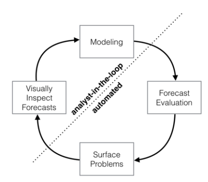

# 先知-时间序列预测

## 介绍

## 时间序列模型

基本模型
$$
y(t)=g(t)+s(s)+h(t)+\epsilon_t
$$
这里，模型将时间序列分成3个部分的叠加，其中$g(t)$表示增长函数，用来拟合非周期性变化的。$s(t)$用来表示周期性变化，比如说每周，每年，季节等，$h(t)$表示假期，节日等特殊原因等造成的变化，最后$\epsilon_t$为噪声项，用他来表示随机无法预测的波动，我们假设$\epsilon_t$是高斯的。事实上，这是generalized additive model(GAM)模型的特例，但我们这里只用到了时间作为拟合的参数。

prophet的工作流如上图所述，通过整合了建模-评估两大模块，实现了时间序列模型的快速迭代优化。

对于GAM的拟合，可以使用backfitting或L-BFGS来进行(我们偏向于选择L-BFGS)。

因此，对于时间序列的预测问题，这里是把该当做了曲线拟合的问题来完成，因此与传统时间序列的方法有所不同。传统时间序列更多的是考虑时间在结构上的依赖关系，比如ARIMA模型，通过放弃这一点有4个好处：

1.更灵活

2.ARIMA建模需要有连续的时间数据，而我们这个方法并不需要，因此我们可以不考虑缺失值的填充问题。

3.拟合非常快，使得交互式探索成为可能。

4.预测模型的参数非常容易解释，因此分析人员可以根据经验来设置一些参数。

### 增长项

**非线性增长**

我们将增长项$g(t)$定义为了一个逻辑函数：
$$
g(t)=\frac{C}{1+exp(-k(t-b))}
$$
这一个函数实际上就是类似于人口增长函数，其中C是人口容量，k是增长率，b是偏移量。显然随着t的增加，$g(t)$越趋于C，k越大，增长速度就越快。

但是如果仅使用这个模型是无法满足要求的，

